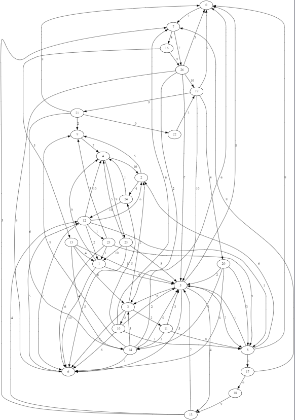
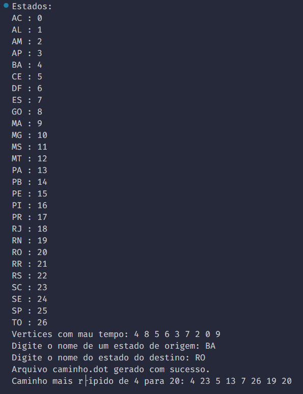
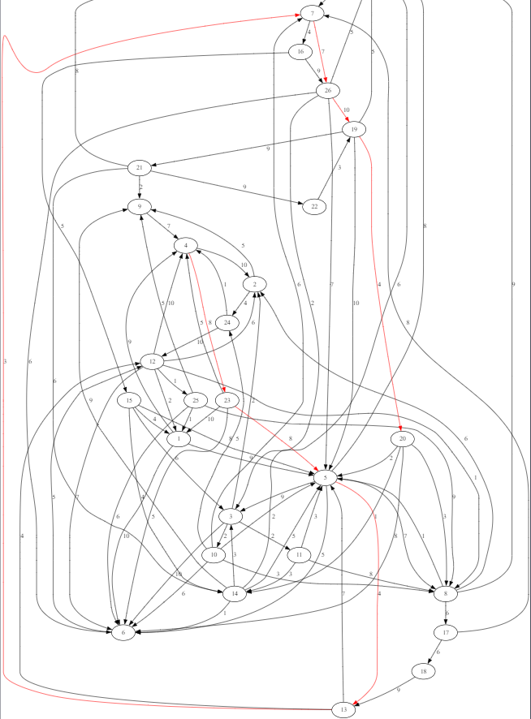

<p align="center">
  <a href="" rel="noopener">
 </a>
</p>

<h3 align="center">Grafos de vias aéreas</h3>

<div align="center">

[]()
[](https://github.com/cyclews/airways-graphs/issues)
[](https://github.com/kylelobo/The-Documentation-Compendium/pulls)
[](/LICENSE)

</div>

---


### Pré-requisitos

É necessário que você rode este código no Visual Studio Code e tenha a seguinte extensão instalada:

```
Graphviz Interactive Preview 
  
by tintinweb
```
## 🧐 Sobre <a name = "about"></a>

O programa se trata de um sistema de Vias áereas que seleciona o melhor caminho entre uma cidade e outra evitando passar em cidades onde há mau tempo ou tenha um custo muito caro!

Ao rodar o programa, ele irá selecionar 9 estados aleatóriamente que terão mau tempo e que tem maior gasto de ida, então gerará um arquivo .DOT que será interpretado pela extensão GRAPHVIZ e gerará uma imagem de todos os caminhos com seus custos.

</a>
</p>

Em seguida pede a você que escolha o estado de origem e destino, então será gerado outro arquivo destacando qual o melhor caminho a ser percorrido com menor gasto e evitando o mau tempo.

</a>
</p>
</a>
</p>


## ⛏️ Ferramentas Utilizadas <a name = "built_using"></a>

- [C++](https://learn.microsoft.com/pt-br/cpp/cpp/?view=msvc-170) - Linguagem base
- [Graphviz interactive preview](https://github.com/tintinweb/vscode-interactive-graphviz/releases) - Extensão utilizada

## ✍️ Autores <a name = "authors"></a>

- [@Fernando Manfrim](https://github.com/FernandoMMattos) 
- [@João Henrique](https://github.com/CycleWs)